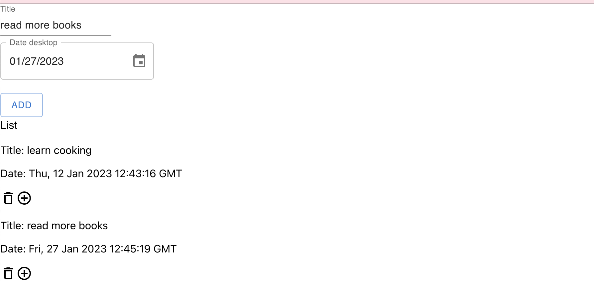
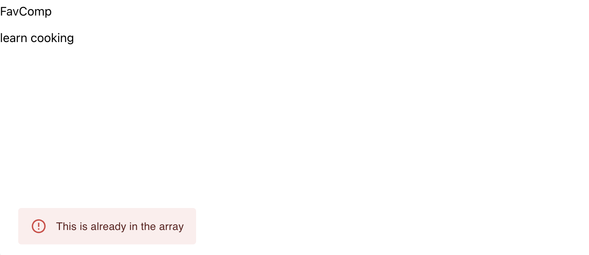

# Redux Toolkit New Year Resolution

The purpose of this project is to practice Redux Toolkit and MUI

## How to run project

1. Step 1: yarn
2. Step 2: yarn start

## Requirements

1. Create a form for the user to insert the resolution
2. It should have at least name and date
3. The user can remove the item in the resolution list
4. When the user add the same item in the favorite list, it should show warning to user.
5. Use `uuid` for the key when render the list
6. Styling is up to you.

## Useful sources

1. SnackBar: `https://mui.com/material-ui/react-snackbar/#main-content`
2. Date:`https://mui.com/x/api/date-pickers/desktop-date-picker/#main-content`
3. uuid: `https://www.npmjs.com/package/uuid?activeTab=dependencies`

## Screenshots

